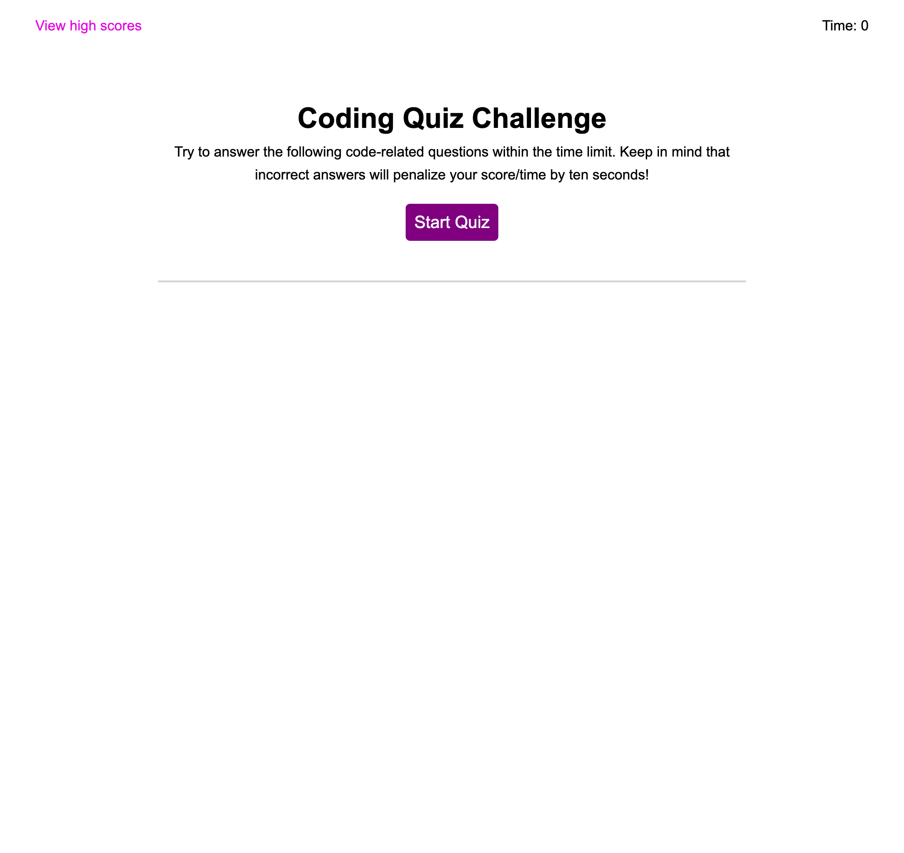

# Code Quiz

## Description
This web application was created to generate a quiz about common programming topics, such as JavaScript, to test a user's knowledge on those topics and saves the user's score to compare their previous attempts and compare their scores to others.

## Installation
N/A

## Usage
When the web app is loaded, the user is presented with instructions for how the quiz works. When they are ready, they can press the "Start Quiz" button and they will be presented with a question and a timer will start counting down from 75. When they answer the question they will receive immediate feedback about whether they answered correctly or incorrectly and, if they answered incorrectly, 10 seconds will be subtracted from their time.

Once all the questions have been answered or the time reaches zero, the user will enter their initials and save their score, which is the amount of time that was left on the timer. They are then presented with a list of high scores to compare their score to earlier attempts or to other users who attempt the quiz. The user has to option to either return to the home screen and attempt the quiz again or clear the high scores. 

You can visit the website [here](https://jakefair97.github.io/code-quiz/) and view a screenshot of the webpage below:

## Credits
N/A

## License
Please refer to the LICENSE in the repo.
